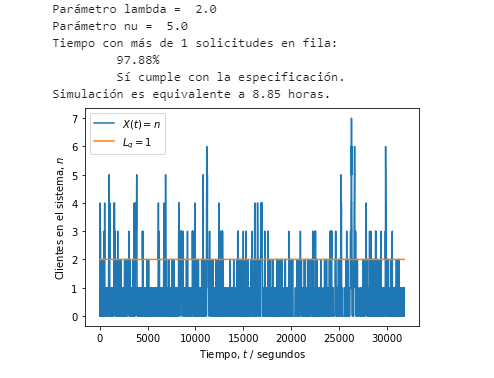

# Tema5

---

## Universidad de Costa Rica
### Escuela de Ingeniería Eléctrica
#### IE0405 - Modelos Probabilísticos de Señales y Sistemas

Segundo semestre del 2020

---

* Estudiante: **David Arguedas Lobo**
* Carné: **B40536**
* Grupo: **1**

---

# `L5` - *Cadenas de Markov*

> El caso especial de los procesos aleatorios donde existen "estados" y "transiciones" entre estos estados, las cadenas de Markov modelan las probabilidades de transición y el tiempo de permanencia entre cada estado. En particular, la teoría de colas describe la evolución del número de elementos en la fila, dado un flujo de entrada y un flujo de salida.

Asignaciones:

La administración del servicio desea ahora que el servidor no esté vacío (sin atender solicitudes) más del 10% del tiempo. Hallar el parámetro v para satisfacer este requisito y modificar el código para medir la variable de interés en una simulación.

---

Se averigua que el parámetro v para que se cumpla, el requisito de que no se quede sin atender solicitudes más del 10% del tiempo, es decir un mínimo del 90% ocupado, es que v sea mayor o igual a 3.2.

Se resuelve un caso para 3.2 para demostrar su valía:

El valor v representa el número de solicitudes realizadas por minuto por lo que se tomará un valor de 4, teniendo en cuenta que para este proceso de solicitudes se toman las solicitudes completadas no las que no se han terminado; por lo que seguidamente mostramos el caso al realizar 4 solicitudes por minuto:

